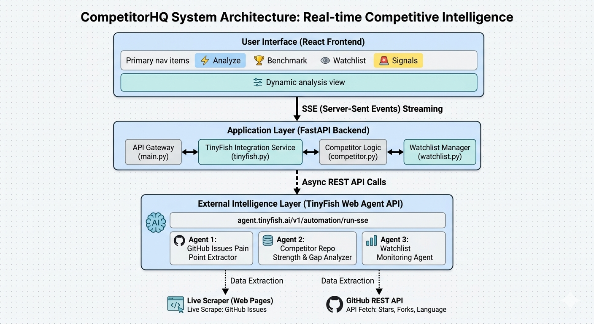

# 🔭 TinyFish_RepoRadar
### Autonomous Web Intelligence Agent for GitHub Repositories

> **"Instead of developers watching their repos, RepoRadar watches for them."**
> 100% powered by TinyFish Web Agent API · Zero external LLM · One API key · Completely free to run.

Built for the **TinyFish Pre-Accelerator Hackathon**

---

## 🚨 The Problem

Every developer and open source maintainer faces the same invisible crisis:

- **Pain points pile up silently** — hundreds of GitHub issues go unread for weeks
- **Competitor repos surge** — you find out after they've already taken your users
- **Viral moments are missed** — your repo trends, but you're asleep and miss the window
- **Bug waves escalate** — issues spike 200%+ and you have no early warning system

The web has all the signals. But it was built for human eyes — not autonomous agents. Developers don't have time to monitor GitHub Issues, competitor repos, and community sentiment simultaneously. And no tool does it for them.

**This is the problem TinyFish was built to solve.**

---

## ✅ The Solution — RepoRadar

RepoRadar is an **autonomous web intelligence system** that monitors GitHub repositories, detects product and community signals, benchmarks against the top competitor, and fires real-time alerts — powered entirely by the TinyFish Web Agent API.

### The Killer Workflow

```
Paste GitHub URL
      │
      ▼
🌐 FAN OUT — TinyFish agent scans live GitHub Issues
      │
      └── 🐛 GitHub Issues Agent → Scrapes real pain points from live issue titles
      │
      ▼
🔍 DETECT SIGNAL — PHAROS-style pattern detection (zero LLM needed)
      │
      ├── 🚨 Bug Wave     — Issues spike 200%+ in 48 hours
      ├── 🚀 Viral Moment — Stars surge 20%+ in 24 hours
      ├── 📉 Bad Release  — Stars drop after a new version
      └── ⚔️  Market Threat — Competitor trending on GitHub
      │
      ▼
🚨 ALERT — AfriGov Sentinel-inspired 8-second dispatch
      │
      ├── Email alert with signal details
      └── Auto-tweet via TinyFish browser automation *(enhancement — full code in autopost.py)*
      │
      ▼
🏆 BENCHMARK — GitHub REST API finds #1 starred competitor
      └── Side-by-side stars, forks, language, strengths, gaps
```

---

## 🐟 How TinyFish Powers Everything

### Agent 1 — GitHub Issues Scraper
```
TinyFish navigates to: github.com/{owner}/{repo}/issues
Goal: "Read visible issue titles. Extract top 5 pain points as JSON."
Challenge solved: Dynamic DOM, label filtering, live data — no scraping library needed
```

### Agent 2 — Competitor Benchmark Agent
```
GitHub REST API finds #1 starred repo in same language (no auth needed)
TinyFish navigates to: github.com/{competitor}/{repo}
Goal: "Read repo page. Extract strengths and unique features."
Challenge solved: Fast hybrid approach — API for hard numbers, TinyFish for qualitative insight
```

### Agent 3 — Watchlist Monitor Agent
```
TinyFish navigates to: github.com/{owner}/{repo}
Goal: "Capture snapshot: stars, forks, issues, recent activity."
Challenge solved: Recurring autonomous monitoring without human trigger
```

### Agent 4 — Auto-Post Agent *(Enhancement in Progress)*
```
TinyFish navigates to: twitter.com/login
Goal: "Log in, compose tweet, click post."
Status: Full implementation in codebase — held out of live demo due to Twitter anti-bot detection
```

> RepoRadar can auto-post directly to Twitter — TinyFish navigates the browser, logs in, and publishes the tweet autonomously. We've kept it out of the live demo since Twitter's anti-bot detection makes it unpredictable in real-time, but the full implementation is in `autopost.py`.

---

## 🏗 Architecture



## 📋 Feature Guide

### ⚡ Analyze
TinyFish agent scans live GitHub Issues → pain points in ~60 seconds
- **Pain Points** — Top issues scraped live, ranked by frequency with fix opportunities
- **Repo Health** — Healthy / Struggling / Critical based on issue patterns
- **Feature Requests** — Top asks from the community, extracted automatically

### 🏆 Benchmark
GitHub REST API finds the #1 starred competitor in the same language → side-by-side comparison
- Stars, forks, language, maturity from the API (always accurate, never `—`)
- Unique strengths and gaps from TinyFish qualitative scrape

### 👁 Watchlist
Add any repo + email → autonomous monitoring → PHAROS-style signal detection → AfriGov 8-second alert dispatch

### 🚨 Signals
Live signal feed with severity levels (Critical / High / Opportunity) and recommended actions

---

## ✅ Setup

```bash
# 1. Get free TinyFish API key
# → https://agent.tinyfish.ai/api-keys (no credit card, 500 free steps)

# 2. Backend
cd backend
python -m venv venv
venv\Scripts\activate
pip install -r requirements.txt
$env:TINYFISH_API_KEY="your_key"
$env:TWITTER_USERNAME="username"    
$env:TWITTER_PASSWORD="password" 
uvicorn main:app --reload --port 8000

# 3. Frontend
cd frontend
npm install
npm run dev
# → http://localhost:5173
```

---

